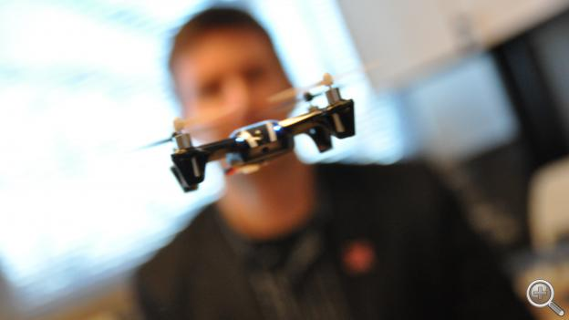
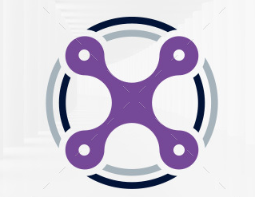
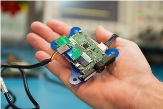
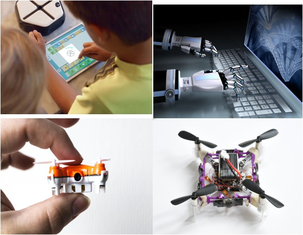
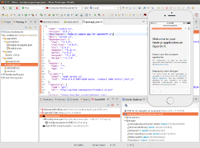
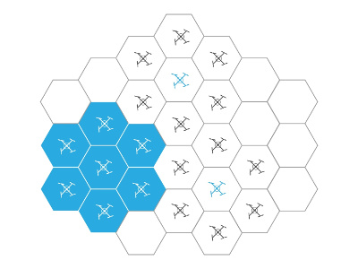
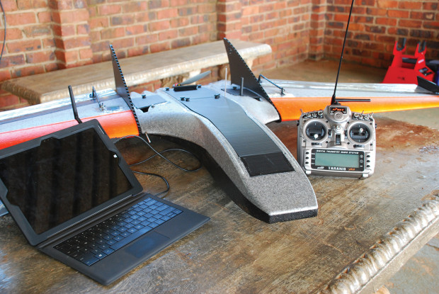
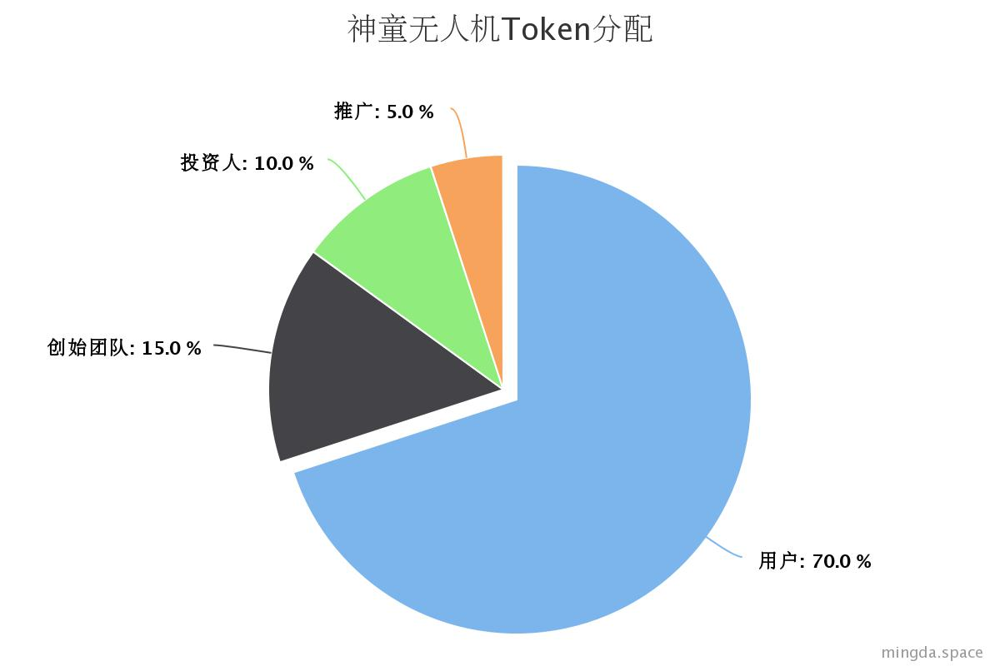
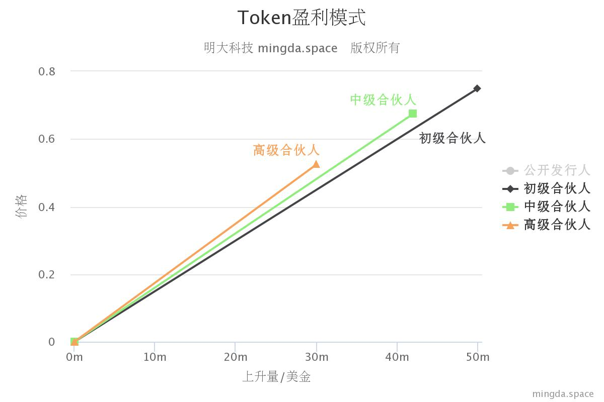
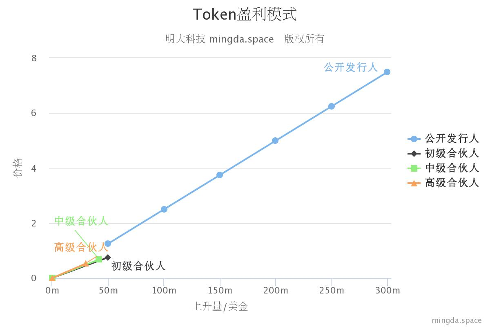

# 0 前言

近几年，民用无人机行业有了长足发展，出现了类似大疆这样的独角兽公司。随着5G通信技术的逐渐应用，以及人工智能，深度学习等领域的繁荣发展，无人机必将向着智能化，网络化，小型化，娱乐化，竞技化发展，这样就给了一些有技术积累的后起之秀更广阔的舞台。所以神童无人机科技公司横空出世，而且神童无人机必将会将整个无人机行业带到2.0时代。

# 1 我们是谁

我们是神童无人机 Child Prodigy UAV！

我们是科学技术高峰的攀登者！
我们是无人机行业的颠覆者！
我们是中国素质教育的践行者！
我们更是中华民族伟大复兴的先锋者！

我们有业界出色的软件硬件研发团队。
我们有技术精湛的飞控算法研发团队。
我们有精研空气动力学的导师。
最后，我们还有背后强大的运作团队！

## 1.1 研发团队介绍

* Jello Huang， the cofounder of Child Prodigy UAV，除了负责公司组建还负责软硬件开发团队的组建与OS相关开发。曾经清华同方任高级软件工程师, 美国硅谷半导体公司翌发科技高级系统工程师，清华信研究院孵化项目公司Digitalproto联合创始人，桂林明大科技创始人，十五年科技行业沉淀，在全球顶级科技公司 Intel,Qualcomm,Apple,Nvidia,Arm，拥有深厚资源，在软硬件协同设计有独到的经验。

* 陈雄山，the chief Scientist of Child Prodigy UAV，主要负责空气动力学设计与分析，系统小型化等艰巨任务，以及神童科技空气动力实验室的组建与新一代空气动力学科学家的培养与选拔。中科院科学家，大气物理学与空气动力学权威专家，专注科研长达62年之久与飞机模型长达半个世纪 历任国内与国外著名大学与机构客座教授，讲座教授，包括MIT,加州理工，哈佛，NASA, 美国海军司令部，欧洲航空局。

* 胡正，the chief software Architecture of Child Prodigy UAV, 主要负责无人机上位机系统软件的开发，Child Prodigy Development Studio研发与架构设计，以及公司内部应用系统的开发和组建，另外还负责上位机与支撑软件事业部的组建。他曾开发过知名开源软件辞典软件星际译王，以及其他优秀开源软件，在开源领域有很高的知名度，是知名Linux黑客程序员。

* Alexander Hsu, the chief Technology Officer of Child Prodigy UAV, 负责公司整体技术架构顶层设计，飞控算法和惯性导航系统的研发，以及惯性导航实验室的组建。大学期间曾经师从中国惯性导航泰斗的弟子郭圣泉教授研发军工项目，对惯性导航，卡尔曼滤波，以及飞行自动控制理论有深刻理解。曾在灵图软件参与开发知名卫星导航软件SmartGuider, 曾在ASRMicro参与基带芯片的开发。深钻人工智能，统计机器学习。

## 1.2 执行团队

* 黄佳辉，the cofounder of Child Prodigy UAV， 负责公司日常行政管理与重大决策。 职业经理人，曾任多年企业高管。

# 2 我们的目标

## 2.1 短期目标

我们的团队要开发一种无铰链刚性旋翼，四轴，多轴概念智能小型飞机，该机是用最佳旋翼速度来进行垂直起降的低负载低旋翼速度无人机，它可以高效的进行低马力巡航，并且续航能力强。这独一无二的设计让智能的航程和续航能力获得了明显的升高。目标让该款人工智能机在室内充分展示优越的竞技性能，智能化，可编程化，摔不坏等特性。

- 资金落地起
- 设计出无人机初始模型 
- 实现出小型化

## 2.2 中期目标

- 产品V1.0版推出招募市场与运营团队开始试运营
- 初步实现智能飞行自动避障系统
- 实现软件互动竞技APP
- 前期基奠研发

## 2.3 长期目标

- 不久的未来，研发与设计一整套软件开发套件(Child Prodigy Development Studio)提供给各个年龄段各个层面的用户，比如对于小学生的所见即所得的模块化，图形化编程，以及针对高端客户的原生native软件系统开发。

- 组建基于区块链的无人机竞赛网络社区，玩家除了在常规竞赛中赢得奖金和tokens，还可以通过分享自己的研发经历，体会，以及开源自己的飞控算法来获取tokens。

- 我们还计划研发一套无人机集群自适应去中心化网络，利用深度学习自动完成复杂的协同任务。

- 在自适应去中心化网络基础上，我们会进军固定翼无人机，在空气动力学领域里做出自己的原创革新。

# 3 股权招募方式 

## 3.1 基本情况

我们神童无人机计划通过发布基于区块链的代币来启动股权招募，为了突出我们在无人机上的专业性，我们将代币命名为DroneCoin(可以简称DRC)。我们计划发布20亿代币tokens分发给四个主要参与群体：普通用户，创始团队，投资者以及推广团队。除了用来股权招募，还用来支撑整个区块链网络的正常运转，以及上文提到的对于无人机社交网络的支撑。在初始阶段，这20亿的代币分给这个四个群体各自的百分比为：

* 普通用户：70%

我们神童无人机的终端客户

* 创始团队：15%

用来资助公司内部相关科学研究，工程，研发，市场等活动。

* 投资者：10%（公募+私募）

主要用于区块链网络未来feature开发，业务发展，合作关系等提供资金。

* 推广：5%

主要用于长期的区块链网络推广，合作伙伴支持，学术支撑，社区建设，等等。

## 3.2 投资者

投资者总体分为公募和私募两个群体，他们总体情况如下：

* 参与资格：在中国的合格的投资人，需要严格的身份认证（采用与IPO相同的流程，以确保合法性）
* 积分占比：10%（2亿枚）
* 积分总金额：2.57亿美元

### 3.1.2 私募

* 时间：2018.7.21~2018.7.24
* 成本：0.75美元/DRC(全部私募价格都一样)
* 分发期和折扣：1年-3年，折扣额0-30%（分发期最低一年）
* 参与人数：150人左右
* 私募金额：大约5200万美元

### 3.1.3 公募

* 时间：2018.8.7-2018.9.7
* 成本计算公式：price = max( $1, amountRaised / $40,000,000 ) USD/DRC（计算公式有点复杂）
* 成本区间：1-5美元
* 分发期和折扣：6个月（0%），1年（7.5%），2年（15%），3年（20%）
* 公募金额：2.05亿美元
* 参与人数：2100+（直接参与人，小编知道有一些是通过代投拿到的）

$$
price = \max(\$1, \frac{amountRaised}{\$40,000,000})
$$

## 3.2 Token分发与折扣

DroneCoin不仅仅是计算机的网络，更是人与组织的网络。经过未来若干年的运营和各方面的努力工作，这个网络将获得成功。我们的目标不仅仅是将无人机推向2.0版本，更让DroneCoin在未来更加有价值，我们要吸引更多对长远价值增长更有兴趣的投资者。

每一个参与团体的分发安排如下：

* 开始时间：从Dronecoin网络上线开始算时间，例如：6个月分发期(vesting period)，网络上线后6个月内发放完毕
* 投资者（积分）：1年最低分发期（私募），6个月最低分发期（公募）
* 创始团队：从最开始计算总共6年，逐年或逐月线性释放。
* 推广：从最开始计算总共6年，逐年或逐月线性释放。
* 用户：6年分发一半

对于投资者，不同的分发周期有一定的折扣：

* 6个月的分发期, 0% 折扣
* 一年的分发期, 7.5% 折扣
* 两年的分发期, 15% 折扣
* 三年的分发期, 20% 折扣

# 4 Dronecoin FAQ

## 什么是tokens销售的上限？

整个分发的DroneCoin有​200,000,000​个。

## DroneCoin总共供应的总量是多少？

整个DroneCoin的生命周期，总的供应量为2,000,000,000 (20亿)个。这些币将在几十年内释放，类似比特币。在头四年将供应总量的一半即，十亿个。